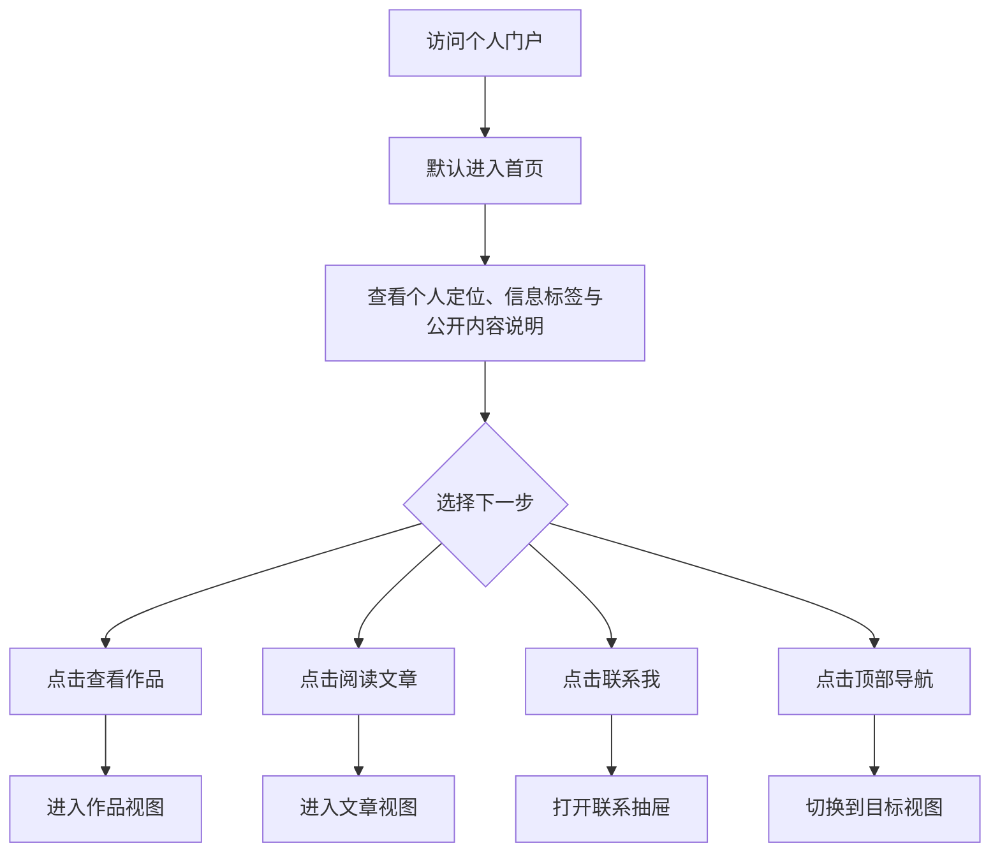
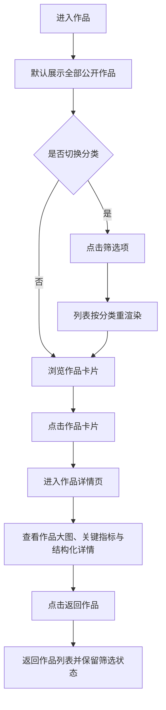
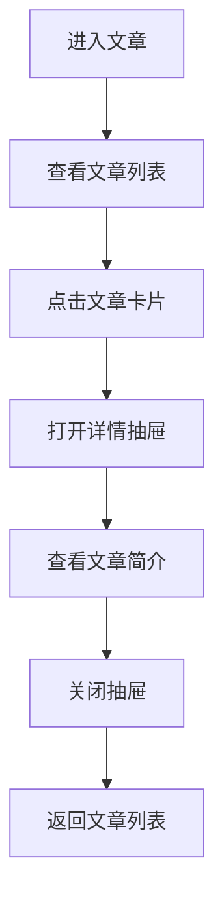
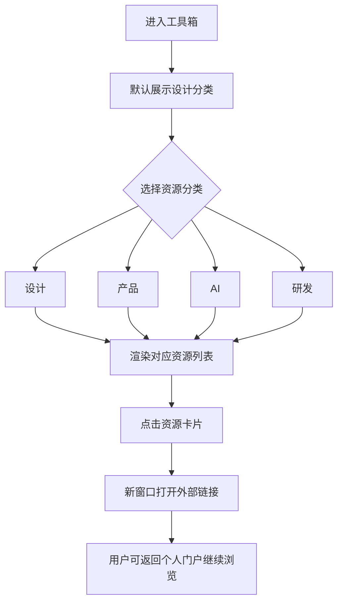
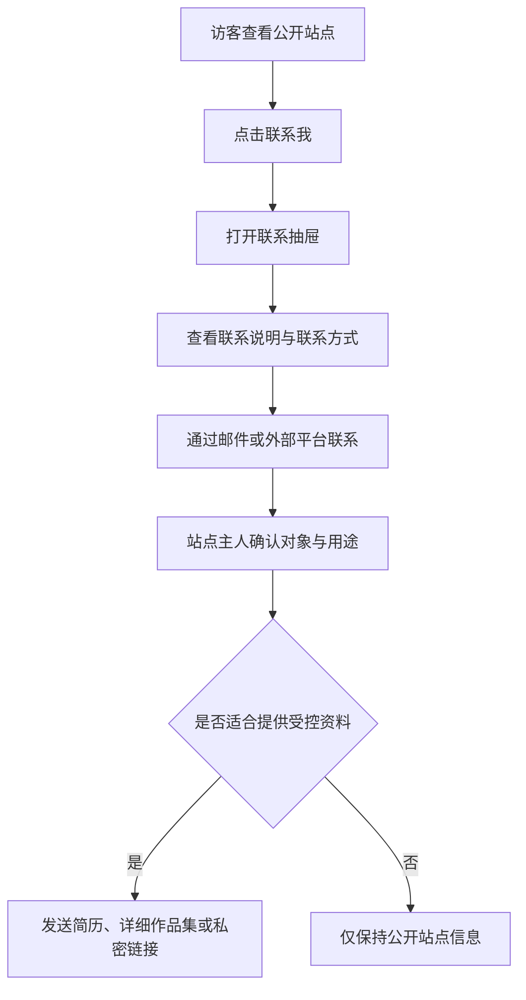

# 个人门户网站核心门户 PRD V1.6

## 一、前言

### 1. 需求基本信息

| 字段 | 内容 |
| --- | --- |
| 需求优先级 | P0 |
| 本部分上线日期 | 待定 |
| 上线单位 | 个人项目 |

### 2. 版本信息

| 字段 | 内容 |
| --- | --- |
| 版本号 | V1.6 |
| 文档信息 | 个人门户网站核心门户功能设计 |
| 产品 | 个人门户网站 |
| 开发负责人 | 待定 |
| 审核人 | 小林 |
| 涉及系统人员 | 产品、设计、前端、测试 |
| 是否跨项目 | 否 |

### 3. 版本变更日志

| 日期 | 版本号 | 变更人 | 变更内容 |
| --- | --- | --- | --- |
| 2026-05-21 | V1.0 | Codex | 初始版本，整理个人主页、作品集、产品经验、博客、快捷导航的门户方案 |
| 2026-05-29 | V1.1 | Codex | 基于 `personal-portal-demo.html` 修订核心门户范围，明确首页、作品集、博客、导航、联系抽屉与响应式规则 |
| 2026-05-29 | V1.2 | Codex | 调整公开站点信息架构与首页文案，将栏目统一为作品、文章、工具箱，并补充公开层与受控层隐私策略 |
| 2026-05-29 | V1.3 | Codex | 去掉首页公开内容提示与资料入口外显命名，统一改为“联系我” |
| 2026-06-05 | V1.4 | Codex | 基于 2023 UI/UX 作品集更新作品集模块，补充本地图片资产、图文卡片、关键指标和结构化详情 |
| 2026-06-05 | V1.5 | Codex | 将当前栏目命名从“作品集”统一为“作品”，移除右侧城市标签，并将背景调整为弥散渐变风格 |
| 2026-06-05 | V1.6 | Codex | 将作品详情由弹窗抽屉调整为二级页面，新增返回作品列表逻辑，文章和联系继续使用抽屉 |

### 4. 产品背景&目标

**背景**

- 个人展示内容通常分散在作品平台、文章、社交主页、常用工具收藏和简历材料中，访客需要自行拼接信息，理解成本较高。
- 个人门户计划发布到公网，面向面试官、潜在合作公司和公开访客，因此不能将完整简历、真实项目细节、敏感数据和内部截图常驻展示。
- 当前已有静态 HTML 原型 `personal-portal-demo.html`，包含首页、作品、文章、工具箱、联系抽屉等基础交互，已能表达“产品设计与 AI 原型实践”的个人定位。
- 现阶段需要将原型内容沉淀为标准 PRD，明确页面结构、交互规则、异常流、埋点和验收范围，为后续正式开发、内容维护和上线发布提供依据。

**目标**

- 建立一个统一的个人门户网站，让访客快速完成“了解定位 → 查看公开作品 → 阅读方法沉淀 → 发起联系”的路径。
- 第一版聚焦核心门户体验：个人定位展示、公开作品展示、文章摘要展示、工具箱展示、联系入口与响应式适配。
- 通过分类筛选、作品详情二级页面、文章抽屉和资源分类切换，降低浏览成本，提升作品查看率和联系转化率。
- 本期不建设登录系统、评论系统、线上 CMS、独立简历页和独立文章详情页；作品详情在静态原型内以二级页面承载，受控资料通过后续沟通按需提供。

---

## 二、需求背景

### 1. 需求清单

| 序号 | 涉及产品 | 涉及模块 | 需求 | 需求描述 |
| --- | --- | --- | --- | --- |
| 1 | 个人门户网站 | 首页 | 个人定位展示 | 首屏展示城市、个人品牌标题、职业方向、基础信息标签、价值陈述和 CTA |
| 2 | 个人门户网站 | 首页 | 能力摘要展示 | 使用 UI/UX、PM、AI 三个能力方向概括个人能力结构 |
| 3 | 个人门户网站 | 作品 | 作品列表展示 | 展示产品项目、设计作品、方法论三类公开作品卡片，卡片包含封面图、标签和结果说明 |
| 4 | 个人门户网站 | 作品 | 作品分类筛选 | 支持全部、产品项目、设计作品、方法论四个筛选项 |
| 5 | 个人门户网站 | 作品 | 作品详情查看 | 点击作品卡片后进入作品详情二级页面，展示脱敏后的背景、问题、方案、关键指标和作品大图 |
| 6 | 个人门户网站 | 文章 | 文章列表展示 | 展示文章标题、摘要、主题标签和阅读时长 |
| 7 | 个人门户网站 | 文章 | 文章详情查看 | 点击文章卡片后通过详情抽屉展示文章摘要详情 |
| 8 | 个人门户网站 | 工具箱 | 资源分类展示 | 按设计、产品、AI、研发四类展示常用工具和工作方式 |
| 9 | 个人门户网站 | 工具箱 | 外链跳转 | 点击资源卡片后在新窗口打开对应工具网站 |
| 10 | 个人门户网站 | 联系 | 联系入口 | 顶部入口和首页 CTA 均可打开联系抽屉 |
| 11 | 个人门户网站 | 全局 | 视图切换 | 顶部导航和首页 CTA 支持在首页、作品、文章、工具箱之间切换 |
| 12 | 个人门户网站 | 全局 | 响应式适配 | 桌面端多列展示，移动端单列展示，避免内容溢出 |
| 13 | 个人门户网站 | 全局 | 可访问性基础 | 支持键盘焦点、Esc 关闭抽屉、遮罩关闭、动效降级 |

### 2. 名词解释

| 术语 | 定义 | 英文对照 |
| --- | --- | --- |
| 个人门户 | 聚合个人定位、作品、文章、资源和联系方式的网站 | Personal Portal |
| 作品 | 展示可公开代表性项目、设计作品和方法沉淀的模块 | Portfolio |
| 产品项目 | 偏产品判断、需求拆解、流程设计和协作推进的案例 | Product Case |
| 设计作品 | 偏视觉、交互、体验设计和设计系统的案例 | Design Work |
| 方法论 | 对工作方法、流程模板、复盘框架的结构化沉淀 | Methodology |
| 文章 | 展示个人观点、方法总结、项目复盘和 AI 工作流文章的模块 | Articles |
| 工具箱 | 聚合常用工具、资料和外部资源的入口列表 | Toolbox |
| 作品详情页 | 点击作品卡片后进入的二级页面，用于承载完整作品图文内容 | Work Detail Page |
| 详情抽屉 | 点击文章或联系入口后覆盖页面展示详情内容的弹层组件 | Drawer |
| 公开层 | 面向所有公网访客展示的脱敏信息层 | Public Layer |
| 受控层 | 通过联系、访问码或私密链接提供给特定对象的完整资料层 | Controlled Layer |
| CTA | 引导访客完成关键行为的按钮，如查看作品、阅读文章、联系我 | Call To Action |

### 3. 核心功能点

| 所属模块 | 功能 | 功能描述 |
| --- | --- | --- |
| 首页 | 首屏定位 | 展示“产品设计与 AI 原型实践”“从 UI/UX 到产品方案落地”等核心定位信息 |
| 首页 | 信息标签 | 展示产品设计、产品管理、UI/UX 转产品、AI 工作流、武汉/远程协作等基础信息 |
| 首页 | CTA | 支持跳转作品、跳转文章、打开联系抽屉 |
| 首页 | 能力摘要 | 展示 UI/UX、PM、AI 三个方向及一句话说明 |
| 作品 | 作品卡片 | 展示封面图、类型、标题、摘要、标签和结果说明 |
| 作品 | 分类筛选 | 按全部、产品项目、设计作品、方法论过滤作品 |
| 作品 | 详情二级页面 | 展示作品大图、图片说明、关键指标、结构化说明和结果沉淀 |
| 文章 | 文章卡片 | 展示标题、摘要、主题标签和阅读时长 |
| 文章 | 文章抽屉 | 展示文章简介详情 |
| 工具箱 | 资源分类 | 支持设计、产品、AI、研发四类互斥切换 |
| 工具箱 | 外链打开 | 资源卡片以新窗口打开外部工具 |
| 联系 | 联系抽屉 | 展示联系说明、邮箱、GitHub 等联系方式 |
| 全局 | 视图切换 | 同一时间只展示一个主视图，导航高亮随视图同步 |
| 全局 | 响应式 | 900px 以下布局切换为单列，隐藏垂直城市标签 |

### 4. 功能点排期

| 序号 | 功能点描述 | 所属模块 | 排期日期 |
| --- | --- | --- | --- |
| 1 | PRD 基于 HTML 原型标准化修订 | 文档 | 第 1 阶段 |
| 2 | 静态 HTML 可交互原型 | 全站 | 第 1 阶段 |
| 3 | 首页真实文案与信息标签确认 | 首页 | 第 1 阶段 |
| 4 | 作品真实内容补充与脱敏校验 | 作品 | 第 2 阶段 |
| 5 | 文章真实内容补充 | 文章 | 第 2 阶段 |
| 6 | 工具箱资源有效性校验 | 工具箱 | 第 2 阶段 |
| 7 | 联系方式替换为真实信息 | 联系 | 第 2 阶段 |
| 8 | 埋点与访问统计接入 | 全局 | 第 3 阶段 |
| 9 | 正式站点框架与内容配置化评估 | 全局 | 第 3 阶段 |

---

## 三、产品流程图

### 3.1 访客浏览主流程



### 3.2 作品筛选与详情查看流程



### 3.3 文章阅读流程



### 3.4 工具箱资源跳转流程



### 3.5 联系流程



---

## 四、产品原型图与规则定义

### 4.1 页面/模块整体结构

- 页面采用单页门户结构，顶部导航包含：首页、作品、文章、工具箱四个主视图入口。
- 首页承载个人定位、基础信息标签、价值陈述、核心 CTA 和能力摘要。
- 作品、文章、工具箱为三个内容视图，通过顶部导航或首页 CTA 切换展示。
- 作品详情使用二级页面承载；文章详情和联系信息继续使用抽屉承载。
- 页面不展示右侧城市竖排标签，首屏信息集中在标题、标签、CTA 和能力摘要。
- 背景使用深色弥散渐变、轻量网格纹理和高对比文字，强化个人品牌识别。
- 公开页面仅展示脱敏后的作品摘要和方法内容，不常驻展示完整简历、真实项目细节、内部截图、敏感数据和私人联系方式。

### 4.2 页面原型图

```text
┌────────────────────────────────────────────────────────────────────┐
│ 首页        作品        文章        工具箱        联系我             │
├────────────────────────────────────────────────────────────────────┤
│                                                                    │
│ Wuhan                                                              │
│                                                                    │
│ 产品设计与 AI 原型实践                                             │
│ 从 UI/UX 到产品方案落地                                             │
│                                                                    │
│ [产品设计] [产品管理] [UI/UX 转产品] [AI 工作流] [武汉/远程协作]     │
│                                                                    │
│ 我关注从用户体验、业务目标到落地协作的完整链路，擅长把复杂需求转化     │
│ 为清晰的产品方案、交互原型和可执行文档。                              │
│                                                                    │
│ [查看作品]   [阅读文章]   [联系我]                                   │
│                                                                    │
│ ┌───────────────┬───────────────┬───────────────┐                  │
│ │ UI/UX         │ PM            │ AI            │                  │
│ │ 设计系统/交互 │ 需求/流程/排期 │ 原型/知识/工具 │                  │
│ └───────────────┴───────────────┴───────────────┘                  │
└────────────────────────────────────────────────────────────────────┘

作品视图
┌────────────────────────────────────────────────────────────────────┐
│ 作品                                                               │
│ 基于 2023 UI/UX 作品集整理图文案例，呈现问题定义和结果沉淀。           │
│ [全部] [产品项目] [设计作品] [方法论]                               │
│ ┌──────────────┐ ┌──────────────┐ ┌──────────────┐                 │
│ │ 封面图        │ │ 封面图        │ │ 封面图        │                 │
│ │ 类型/标签     │ │ 类型/标签     │ │ 类型/标签     │                 │
│ │ 案例标题      │ │ 案例标题      │ │ 案例标题      │                 │
│ │ 摘要          │ │ 摘要          │ │ 摘要          │                 │
│ │ 目标/结果     │ │ 目标/结果     │ │ 目标/结果     │                 │
│ └──────────────┘ └──────────────┘ └──────────────┘                 │
└────────────────────────────────────────────────────────────────────┘

作品详情页
┌────────────────────────────────────────────────────────────────────┐
│ [返回作品]                                      [产品项目]          │
│                                                                    │
│ 类型标签                                                            │
│ 作品标题                                                            │
│ 作品脱敏说明                                                        │
│                                   ┌────────────────────────────┐    │
│                                   │ 项目结果                   │    │
│                                   │ 目标/结果说明              │    │
│                                   └────────────────────────────┘    │
│ ┌────────────────────────────────────────────────────────────────┐ │
│ │ 作品大图 / 图片说明                                             │ │
│ └────────────────────────────────────────────────────────────────┘ │
│ [关键指标] [关键指标] [关键指标]                                    │
│ ┌──────────────┐ ┌──────────────┐ ┌──────────────┐ ┌──────────────┐ │
│ │ 项目背景      │ │ 我的工作      │ │ 关键设计      │ │ 结果沉淀      │ │
│ └──────────────┘ └──────────────┘ └──────────────┘ └──────────────┘ │
└────────────────────────────────────────────────────────────────────┘

文章/联系抽屉
┌────────────────────────────────────────────────────────────────────┐
│                            遮罩层                                  │
│              ┌────────────────────────────────┐                    │
│              │ 详情标题                       │                    │
│              │ 详情正文 / 作品大图             │                    │
│              │ 关键指标 / 结构化说明           │                    │
│              │                         [关闭] │                    │
│              └────────────────────────────────┘                    │
└────────────────────────────────────────────────────────────────────┘
```

### 4.3 通用交互规则

- 默认进入页面时展示首页，首页导航项处于高亮状态。
- 点击顶部导航后，隐藏当前视图，展示目标视图，并同步更新导航高亮。
- 点击首页“查看作品”切换到作品视图；点击“阅读文章”切换到文章视图；点击“联系我”打开联系抽屉。
- 点击作品卡片后切换到作品详情二级页面，顶部导航仍高亮“作品”。
- 点击作品详情页“返回作品”后回到作品列表，并保留当前筛选状态。
- 同一时间只允许一个主视图处于激活状态。
- 同一时间只允许一个详情抽屉打开；作品详情页不使用抽屉。
- 抽屉支持三种关闭方式：关闭按钮、点击遮罩、按 Escape 键。
- 抽屉打开后焦点进入关闭按钮；抽屉关闭后焦点恢复到打开抽屉前的元素。
- 所有外部资源链接必须使用新窗口打开，并配置 `rel="noopener noreferrer"`。
- 触发视图切换、筛选切换、抽屉打开、外链跳转的元素均需要具备可见焦点状态。
- 当用户系统设置为减少动效时，页面动效应降级到最小。

### 4.4 信息公开策略

#### 1. 定义

信息公开策略用于明确公开站点和受控资料的边界，保证网站可以面向公网发布，同时保护个人隐私、项目保密信息和合作方信息。

#### 2. 规则

- 公开层面向所有公网访客，展示个人定位、能力方向、脱敏作品摘要、方法文章、工具箱和联系入口。
- 受控层仅面向经过确认的面试官、合作公司或特定沟通对象，提供完整简历、详细作品集、真实项目过程、项目截图和更多联系方式。
- 公开作品不得展示真实公司名称、内部数据、未授权截图、商业敏感流程、完整项目文档和私人联系方式。
- 联系入口不直接下载文件，只提供沟通路径；简历、详细作品集等受控资料由站点主人在后续沟通中判断是否提供。

#### 3. 活动/交互

- 访客点击“联系我”后打开抽屉，查看说明和联系方式。
- 站点主人在线下或邮件沟通中确认对方身份、用途和资料范围。
- 确认通过后，再发送简历 PDF、详细作品集、访问码页面或私密链接。

### 4.5 首页

#### 1. 定义

首页是个人门户的第一入口，用于建立个人定位、基础信任和下一步浏览路径。

#### 2. 规则

- 首屏标题固定为个人品牌主表达，当前原型为“产品设计与 AI 原型实践”。
- 职业方向展示为“从 UI/UX 到产品方案落地”，用于概括能力组合和发展路径。
- 信息标签展示基础身份与工作方式，建议控制在 4 到 5 个，不展示敏感信息。
- 价值陈述文案不超过 120 字，强调用户体验、业务目标、产品方案、交互原型和可执行文档。
- 首页主 CTA 包含“查看作品”“阅读文章”“联系我”，其中“查看作品”为主按钮。
- 能力摘要固定展示 3 个方向：UI/UX、PM、AI。

#### 3. 活动/交互

- 点击“查看作品”后进入作品视图。
- 点击“阅读文章”后进入文章视图。
- 点击“联系我”后打开联系抽屉。
- 顶部“联系我”入口点击后打开联系抽屉。

### 4.6 作品

#### 1. 定义

作品用于展示可公开的代表性产品项目、设计作品和方法论内容，是访客判断个人能力的核心模块。

#### 2. 规则

- 默认展示全部案例。
- 筛选项包括：全部、产品项目、设计作品、方法论。
- 筛选项互斥激活，每次仅一个筛选项处于高亮状态。
- 作品卡片字段包括：封面图、类型标签、标题、摘要、标签、目标或结果说明。
- 作品详情字段包括：标题、脱敏详细描述、作品大图、图片说明、关键指标、结构化章节和目标或结果补充说明。
- 作品当前原型包含 6 个条目：高校一站式服务大厅、业务流程与功能架构、服务大厅体验改版问题分析、武汉大学樱花预约、招生概况数据大屏、2023 UI/UX 作品集结构化整理。
- 作品图片资产来自 Figma 画板截图，已下载到 `assets/portfolio/` 本地目录供原型稳定引用。
- 作品详情不得展示公司名称、真实业务数据、内部截图和不可公开流程。

#### 3. 活动/交互

- 点击筛选项后，案例列表即时按类型过滤并重渲染。
- 点击作品卡片后进入作品详情二级页面。
- 作品详情页展示项目背景、我的工作、关键设计、结果沉淀、作品图片和关键指标。
- 作品详情页顶部展示“返回作品”按钮。
- 点击“返回作品”后回到作品当前筛选状态，不重置筛选项，并优先恢复到进入详情前的作品卡片焦点。

### 4.7 文章

#### 1. 定义

文章用于沉淀产品转型、设计复盘、AI 工作流和知识管理内容，增强访客对个人方法论和表达能力的判断。

#### 2. 规则

- 文章列表字段包括：标题、摘要、主题标签、阅读时长。
- 当前原型包含 4 篇文章：从设计评审到产品决策、如何整理一个可复用的作品模板、AI 辅助 PRD 的边界、B 端页面的信息密度。
- 文章详情当前不单独跳转页面，统一使用详情抽屉展示。
- 文章卡片需要支持鼠标点击和键盘 Enter 打开详情。

#### 3. 活动/交互

- 点击文章卡片后打开详情抽屉。
- 按 Enter 键可打开当前聚焦文章卡片详情。
- 详情抽屉展示文章简介、主题标签和阅读时长。

### 4.8 工具箱

#### 1. 定义

工具箱用于聚合个人常用工具、资料和工作入口，既能对外展示工具体系，也能作为本人日常快捷入口。

#### 2. 规则

- 工具箱分类包括：设计、产品、AI、研发。
- 默认展示设计分类。
- 分类互斥激活，每次仅一个分类高亮。
- 资源卡片字段包括：资源名称、用途说明、外链 URL、打开提示。
- 当前原型资源包括 Figma、Mobbin、Dribbble、IconFont、Notion、Linear、Google Analytics、飞书文档、ChatGPT、Perplexity、Midjourney、Cursor、GitHub、Vercel、MDN、Tailwind CSS。

#### 3. 活动/交互

- 点击分类按钮后，资源列表即时切换。
- 点击资源卡片后，新窗口打开外部链接。
- 外链打开后，当前个人门户页面保持原状态。

### 4.9 联系抽屉

#### 1. 定义

联系抽屉用于承载联系说明，是访客从浏览进入面试、合作或进一步沟通的关键路径。

#### 2. 规则

- 联系入口包括顶部“联系我”按钮和首页“联系我”按钮。
- 抽屉内容包括标题、联系说明、邮箱入口、GitHub 入口。
- 当前原型邮箱为占位信息 `hello@yourdomain.com`，上线前必须替换为真实邮箱。
- 抽屉关闭后应恢复到打开前的焦点位置。

#### 3. 活动/交互

- 点击邮箱后打开用户本地邮件客户端。
- 点击 GitHub 后新窗口打开外部链接。
- 点击关闭按钮、遮罩或按 Escape 后关闭抽屉。

### 4.10 专项规则定义

- 内容数据建议后续拆分为 `cases`、`blogPosts`、`resources`、`contact` 四类配置，避免长期维护时直接修改页面结构。
- 本期 HTML 原型中的详情内容可作为占位内容，正式上线前需补充真实但已脱敏的项目、真实文章和真实联系方式。
- 本期作品详情已采用二级页面承载；若后续升级为正式站点，可继续扩展为独立路由或独立详情页。
- 文章详情当前仍使用抽屉承载，后续可按内容长度升级为独立文章详情页。
- 视觉风格以深色科技感、城市感、高对比标题、电光蓝和品红点缀为主，需保证文字可读性优先于氛围效果。

---

## 五、异常流与边界条件

### 5.1 异常流处理

| 异常场景 | 错误码 | 用户提示 | 系统处理 | 恢复路径 |
| --- | --- | --- | --- | --- |
| 作品数据为空 | - | 作品正在整理中 | 展示空状态，不渲染空白卡片区 | 返回首页或打开联系入口 |
| 当前作品分类无数据 | - | 该分类暂无内容 | 保持筛选项高亮，展示分类空状态 | 切换其他分类或返回全部 |
| 作品详情缺失 | - | 详情内容暂未完善 | 不进入空白详情页，或展示兜底说明 | 返回作品继续浏览 |
| 作品内容疑似敏感 | - | 不对访客显式提示 | 上线前移除或脱敏处理 | 通过受控资料方式提供 |
| 文章为空 | - | 内容即将上线 | 展示文章空状态 | 返回首页、作品或工具箱 |
| 文章详情缺失 | - | 文章详情暂未完善 | 不打开空白抽屉，或展示摘要兜底 | 返回文章列表 |
| 资源分类无数据 | - | 该分类暂无资源 | 展示分类空状态 | 切换其他分类 |
| 外链 URL 为空 | - | 链接暂未配置 | 不展示可点击态或禁用卡片 | 继续浏览其他资源 |
| 外链无法访问 | - | 浏览器提示无法访问 | 站点不拦截浏览器原生错误 | 返回个人门户继续浏览 |
| 联系方式为空 | - | 联系方式暂未开放 | 隐藏对应联系项 | 使用其他联系方式 |
| 背景图片加载失败 | - | 无需显式提示 | 使用背景色和渐变兜底 | 继续浏览 |
| 目标视图不存在 | - | 无需显式提示 | 保持当前视图，不切换状态 | 重新点击有效导航 |

### 5.2 边界条件

| 维度 | 边界值 | 处理方式 |
| --- | --- | --- |
| 首页信息标签数量 | 0 个 | 隐藏标签组，保留标题和价值陈述 |
| 首页信息标签数量 | 超过 5 个 | 建议折行展示，正式上线前精简 |
| 价值陈述文案 | 超过 100 字 | 控制行宽，避免首屏信息过载 |
| 作品数量 | 0 个 | 展示空状态 |
| 作品数量 | 超过 12 个 | 后续增加分页、搜索或推荐排序 |
| 作品标题 | 超过 2 行 | 卡片内截断，详情页展示完整标题 |
| 作品摘要 | 超过 3 行 | 卡片内截断，详情页展示完整内容 |
| 文章数量 | 0 个 | 展示空状态 |
| 资源单分类数量 | 超过 12 个 | 后续增加搜索或分组 |
| 抽屉数量 | 同时打开超过 1 个 | 禁止同时打开多个抽屉 |
| 桌面宽度 | 大于 900px | 作品三列，文章和资源两列 |
| 移动端宽度 | 小于等于 900px | 全部列表和作品详情页切换为单列展示 |
| 用户减少动效设置 | 开启 | 动画和过渡降级到最短时长 |
| 受控资料入口 | 直接下载文件 | 不允许公开直接下载，必须先通过联系、访问码或私密链接承接 |

---

## 六、数据埋点

### 6.1 核心事件

| 事件名称 | 触发时机 | 属性字段 | 业务口径 |
| --- | --- | --- | --- |
| home_view | 页面加载并展示首页 | referrer、device、viewport_width | 统计个人门户访问量和访问设备 |
| nav_click | 点击顶部导航 | nav_name、target_view、current_view | 统计主视图访问偏好 |
| hero_cta_click | 点击首页 CTA | cta_name、target_type、target_view | 统计首页核心转化点击 |
| work_filter | 点击作品筛选项 | filter_type、result_count | 判断访客关注的作品类型 |
| work_open | 点击作品卡片进入详情页 | work_title、work_type、position | 统计作品关注度 |
| work_detail_back | 点击作品详情页返回作品 | work_title、work_type | 判断作品详情页退出路径 |
| article_open | 点击文章卡片打开详情 | article_title、tag、position | 统计文章关注度 |
| resource_filter | 点击工具箱资源分类 | resource_type、result_count | 判断工具分类偏好 |
| resource_click | 点击资源外链 | resource_name、resource_type、url | 统计资源使用偏好 |
| contact_open | 打开联系抽屉 | source、current_view | 统计联系意向来源 |
| drawer_close | 关闭详情抽屉 | drawer_type、close_method | 判断抽屉使用和退出方式 |

### 6.2 补充事件

| 事件名称 | 触发时机 | 属性字段 | 业务口径 |
| --- | --- | --- | --- |
| focus_visible_trigger | 键盘焦点进入可交互元素 | element_type、element_name | 评估键盘可访问路径 |
| reduced_motion_detected | 检测到减少动效设置 | device、viewport_width | 评估动效降级覆盖情况 |
| external_link_error_feedback | 用户反馈外链失效 | resource_name、url | 维护资源有效性 |
| empty_state_view | 展示空状态 | module_name、filter_type | 发现内容缺口 |
| contact_request | 访客通过邮箱或外部平台发起联系 | source、channel | 统计联系线索 |

---

## 七、功能清单与排期

| 功能点 | 优先级 | 负责人 | 验收标准 | 状态 |
| --- | --- | --- | --- | --- |
| PRD 标准化修订 | P0 | Codex | 文档符合仓库 PRD 模版结构，覆盖 HTML 原型实际范围 | 已完成 |
| HTML 静态原型 | P0 | Codex | 可本地打开，支持首页、作品、作品详情页、文章、工具箱、联系抽屉 | 已完成 |
| 首页公开文案确认 | P0 | Codex | 个人定位、信息标签、价值陈述、CTA 文案均已调整 | 已完成 |
| 作品内容维护与脱敏 | P0 | Codex | 至少 6 个作品均具备标题、类型、摘要、封面图、结果说明和脱敏详情 | 已完成 |
| 联系方式替换 | P0 | 待定 | 邮箱和外部平台链接替换为真实有效信息 | 待开始 |
| 资源链接校验 | P1 | 待定 | 设计、产品、AI、研发四类外链均可正常打开 | 待开始 |
| 文章内容维护 | P1 | 待定 | 至少 4 篇文章具备标题、摘要、标签、阅读时长和详情 | 待开始 |
| 空状态补充 | P1 | 待定 | 作品、文章、资源为空时均有明确提示 | 待开始 |
| 受控资料承接方式确认 | P1 | 待定 | 明确使用邮件、访问码页面、私密链接或 PDF 附件承接完整资料 | 待确认 |
| 访问统计接入 | P2 | 待定 | 核心事件可被统计工具采集 | 待确认 |
| 正式站点框架评估 | P2 | 待定 | 明确继续单 HTML 维护或升级为正式前端框架 | 待确认 |

---

## 八、待办事项

### 8.1 产品决策待确认

- [x] 个人门户主标题调整为“产品设计与 AI 原型实践”。
- [x] 职业方向调整为“从 UI/UX 到产品方案落地”。
- [x] 首页新增公开内容说明，明确完整简历和详细作品资料联系后按需提供。
- [x] 作品中的 6 个条目已基于 2023 UI/UX 作品集补齐图文内容。
- [ ] 作品中的 6 个条目是否均可正式公开展示，是否需要进一步脱敏。
- [ ] 文章内容是否仅展示摘要，还是后续升级为独立文章详情页。
- [ ] 工具箱资源是否全部公开，还是仅展示精选工具。
- [ ] 联系方式是否展示邮箱、GitHub、微信或其他平台。
- [ ] 受控资料使用邮件、访问码页面、私密链接还是 PDF 附件承接。

### 8.2 技术设计待细化

- [ ] 是否继续以单 HTML 形式维护，或升级为 Next.js、Vite 等正式站点框架。
- [ ] 是否将作品、文章、资源和联系方式拆分为独立 JSON 配置。
- [ ] 是否支持 URL hash 或路由参数记录当前视图状态。
- [ ] 是否增加资源搜索、作品搜索或内容排序能力。
- [ ] 是否需要接入轻量访问统计工具。
- [ ] 是否需要为移动端增加折叠菜单。

### 8.3 依赖系统待确认

- [ ] 正式部署平台和访问域名。
- [x] 原型阶段作品图片已下载到本地 `assets/portfolio/` 目录。
- [ ] 正式上线阶段背景图片和作品图片资源托管方式。
- [ ] 真实邮箱、GitHub、作品平台、社交平台链接。
- [ ] 访问统计工具选型。
- [ ] 公开作品和文章的内容授权范围。
- [ ] 完整简历、详细作品集、项目截图等受控资料的存放与访问方式。

---

## 九、性能要求

### 9.1 响应时间

- 首屏核心内容应在 2 秒内可见。
- 顶部导航切换、作品筛选、资源分类切换等本地交互应在 100ms 内完成反馈。
- 抽屉打开和关闭动效应在 300ms 内完成，避免阻塞用户继续浏览。

### 9.2 并发要求

- 第一版为静态站点，无服务端并发要求。
- 外链跳转由浏览器处理，不依赖站点服务端能力。

### 9.3 可用性要求

- 支持桌面端、平板端、移动端访问。
- 主要内容在 375px 宽度下不得横向溢出。
- 关键按钮、卡片和链接需支持键盘聚焦。
- 文本颜色与背景对比度需满足基础可读性要求。
- 页面背景不依赖外部图片；作品图片加载失败时，页面仍应通过标题、摘要和详情文案保持可读。

---

## 十、附录

### 10.1 当前 HTML 原型评估摘要

- 优点：单文件即可运行，结构清晰，已具备首页、作品、作品详情页、文章、工具箱、联系抽屉和基础响应式能力。
- 优点：数据集中在脚本区域，便于快速维护作品、文章和资源内容。
- 优点：作品详情页提供返回作品列表逻辑，文章和联系抽屉已包含焦点转移、Esc 关闭、遮罩关闭和焦点恢复等基础可访问性处理。
- 风险：邮箱、GitHub 和文章详情上线前需要替换为真实内容。
- 风险：作品内容公开发布前需要逐条脱敏，避免暴露公司名称、真实数据、内部截图和不可公开流程。
- 风险：当前没有空状态渲染逻辑，作品、文章或资源为空时可能出现空白区域。
- 风险：当前没有路由和 URL 状态，刷新后无法保留用户所在视图。
- 风险：作品图片资源仍需在正式上线前确认压缩策略和托管方式。

### 10.2 视觉方向说明

- 基调：深色、现代、科技感、个人品牌化。
- 关键词：弥散渐变、沉浸式背景、高对比标题、电光蓝、品红、微荧光绿、半透明面板、细线导航、轻量网格。
- 避免：通用商务模板、大量营销口号、过度堆叠卡片、低对比文字、遮挡正文的背景图。

### 10.3 当前原型功能映射

| 原型区域 | 对应 PRD 模块 | 说明 |
| --- | --- | --- |
| 顶部导航 | 全局视图切换 | 首页、作品、文章、工具箱四个主视图 |
| 首页 Hero | 首页 | 个人定位、信息标签、价值陈述和 CTA |
| 能力摘要 | 首页 | UI/UX、PM、AI 三项能力 |
| `caseCards` | 作品 | 动态渲染作品卡片 |
| `caseDetailPage` | 作品 | 承载作品详情二级页面 |
| `blogList` | 文章 | 动态渲染文章卡片 |
| `resourceList` | 工具箱 | 动态渲染资源卡片 |
| `detailDrawer` | 详情抽屉 | 承载文章详情和联系信息 |
| `showView(name)` | 全局交互 | 控制视图切换和导航高亮 |
| `renderCases(type)` | 作品 | 控制作品筛选和列表渲染 |
| `renderCaseDetail(item)` | 作品 | 控制作品大图、标签、关键指标和结构化详情渲染 |
| `openCaseDetail(item)` | 作品 | 将作品数据写入详情页并切换到二级页面 |
| `backToPortfolio()` | 作品 | 从作品详情页返回作品列表 |
| `renderResources(type)` | 工具箱 | 控制资源分类和列表渲染 |
